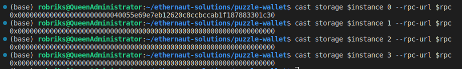
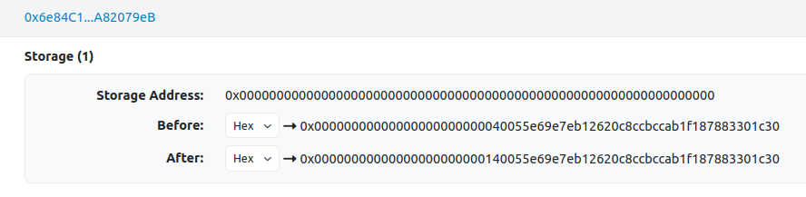

# Ethernaut Walkthrough: Alien Codex
## Welcome to KweenBirb's 20th installment of Ethernaut walkthroughs!
Ethernaut is a set of gamified Solidity challenges in the style of a CTF, where each level features a hackable smart contract that will inform you of various known security vulnerabilities on EVM blockchains.

This repo will walk you through a solution to AlienCodex.sol, the 20th challenge in the series. You can find the challenge itself and fully fleshed out solution in the .txt and .sol files in this directory. Let's begin!

OpenZeppelin instructs us that we've found an Alien contract and must 'claim ownership to complete the level.'

Interesting, yet a simple prompt: the contract gives us a way to tabulate any contact with alien species as well as record, retract, and revise relevant entries in a codex. There isn't even a storage address variable named owner declared in this contract for us to interact with! Ownership is handled by the imported inheritance of Ownable.sol. Tricky!

## A hint in the objective

Let's start by thinking on a high level: how can it be possible to claim ownership of a contract if there isn't even an owner variable declared in the child contract? The inheritance of Ownable must therefore handle the permanent storage of an owner address- but we're not given the source code for the parent Ownable-05.sol contract.

The logical first place to look would have been at the source code of that Ownable-05.sol contract, to see if any exploits to take ownership could happen at that level. Are we willing to run the (fantastic!) Heimdall decompiler by Jon-Becker (link included below if you're interested!) to convert inherited bytecode to human-readable format and scour it for bugs? Doesn't seem like the point of this challenge, so we should consider other ways to exploit inherited storage.

## Inspecting storage with Foundry

While we're on the topic, let's identify the storage layout of this contract so we can pinpoint the target storage variable that we'd like to overtake. Thankfully Foundry provides a convenient and intuitive way to do so with the nifty ```cast storage``` functionality. Simply provide the required parameters as follows:

```
cast storage $YOUR_ETHERNAUT_ADDRESS_HERE 0 --rpc-url $RPC_ENDPOINT_TO_YOUR_ETHERNAUT_NETWORK
```

Where the 0 refers to the storage slot. You'll note the return value for this slot is a 20 byte value, most likely an address. Let's continue mapping out the contract's storage structure to get an idea of what's inherited and what isn't. We do so by rerunning the command a few times, replacing the slot parameter.



This tells us we've run into two options: it's possible that the inheriting contract possesses several storage variables with uninitialized values, or the Ownable-05.sol contract only has one storage value, the owner address that we'd like to conquer. To see which values correspond to the child contract's storage values, let's change one and note the difference!

## Trial and error

The AlienCodex contract provides a handy way to initialize its first storage value:

```
function make_contact() public {
    contact = true;
}
```

So we'll call it and observe any changes by running the below command, again making use of Foundry.

```
cast send $YOUR_ETHERNAUT_ADDRESS_HERE "make_contact()" --private-key $YOUR_PK_HERE --rpc-url $RPC_ENDPOINT_TO_YOUR_ETHERNAUT_NETWORK 
```

Once the transaction confirms, we have a look at what state changes were carried out. This can be done using Foundry or a block explorer, like this:



There we have it, a boolean true value packed into the same slot that holds the address we found earlier! Confirmation that the contract's 0 storage slot contains the owner address (as well as the 'contact' storage boolean).

## Target identified

But that leaves us wondering, how do we change the content of the _entire_ owner storage slot when the make_contact() function only sets the contact boolean to true?

Time to find a vulnerability elsewhere! Looking over the contract's other functions, we can see some logic of interest in the revise() function: a bytes32 parameter passed in and then used to reassign a value within the dynamic bytes32[] array in storage: codex[]. Knowing that working with dynamic bytes arrays can be dangerous, especially when writing to storage while accepting unrestricted bytes parameters, that'll definitely be our best shot at hacking this codebase.

In theory, we could do something along the lines of underhandedly accessing the address + bool (owner & contact) slot from the dynamic bytes32 codex array. Unfortunately for evil masterminds such as ourselves, Solidity restricts access to arbitrary indexes within a dynamic array by limiting valid indexes to the length of the dynamic array.

But the dynamic bytes32 codex array resides in a storage slot neighboring the one we're interested in, right? Can't we just underflow to reach over and take control of the contract? No, and no, at least not exactly in that way- but kudos for noticing that AlienCodex is written in Solidity ^0.5.0 and therefore vulnerable to underflow. To understand our next move, we need a deeper understanding of how arrays work in Solidity.

## Quick aside on arrays

Since the length of dynamic arrays can change at any time, Solidity needs to handle storage in a way that is both sequential and yet doesn't cause collisions while expanding or contracting.

For example, the dynamic bytes32 codex array can't store all its values where it's declared next to the 0 slot containing the owner address and contact boolean because if there were a storage variable declared after the codex declaration, it would be overwritten if the codex array overgrew its expected length!

To mitigate this, Solidity instead stores the current value of the length of the dynamic array in the slot where it's declared and puts the array values themselves in an unreachable location: the storage slot corresponding to the result of hashing the declaration slot. In this case, we know that the owner and contact variables occupy this contract's 0 storage slot, which means that the codex array declaration puts the array length one storage slot higher, in slot 1. As a result, the storage location of the array itself would be ```keccak256(1)```, a reliably safe distance from any data that might grow and overwrite it.

## The underflow bit

Luckily for us, AlienCodex provides two utility functions for us to expand and contract the array: ```record()``` and ```retract()```

Knowing that Solidity version ^0.5.0 requires SafeMath to resist over/underflow, we can bypass the restriction on accessible indexes imposed on the dynamic bytes32 codex array by Solidity! Just think about how massive that is- we've just rendered every index in EVM existence (ie 0 : 2^256--) accessible, which when combined with the ```revise()``` function has the nifty consequence of allowing us to manipulate _every single_ storage address of this contract. Every. Last. One.

## GG

As we know, the codex array starts at storage slot 1, the storage slot where the array's first member begins is ```keccak256(1)```. Provided this information, hackers like us can reach into the storage slot housing the value of the contract owner (+ contact boolean) by manipulating storage slot 0, which is exactly ```keccak256(1)``` away from the array's first member.

Thus, we can use twos complement to find the distance that would overflow us back to 0! Let's create a malicious contract with a function to calculate these big numbers for us and pwn the AlienCodex. First we'll need to set up an interface and an instance of the AlienCodex:

```
interface Codex {
    function make_contact() external;
    function record(bytes32 _content) external;
    function retract() external;
    function revise(uint i, bytes32 _content) external;
}

contract Reacharound {
    function reachInThere(address $your_ethernaut_address_here) public {
        // instantiate victim contract, underflow array index
        Codex codex = Codex($your_ethernaut_address_here);
        
        // ...
    }
}
```

Then we can trigger the underflow, unlocking all available array indexes, and identify the distance to slot 0:

```
function reachInThere(address $your_ethernaut_address_here) public {
    // instantiate victim contract, underflow array index
    Codex codex = Codex($your_ethernaut_address_here);
    codex.retract();

    // calculate and typecast target values
    uint arrayLengthSlot = 1;
    uint arraySlot = uint(keccak256(abi.encode(arrayLengthSlot)));
    // calculate 2**256 - arraySlot + 1
    uint zeroSlot = (115792089237316195423570985008687907853269984665640564039457584007913129639935 - arraySlot) + 1;

    // ...
```

Finally, we craft our payload to inject by taking our own address as the caller and typecasting it to bytes32 so it can be provided to AlienCodex's vulnerable revise() function.

```
    // format msg.sender to bytes to replace owner that is left padded in storage slot
    bytes32 newOwner = bytes32(bytes20(msg.sender)); // rightpadded
    bytes32 shiftedOwner; 
    assembly {
        shiftedOwner := shr(mul(12,8), newOwner) // shr takes bits argument, not bytes
    }
    
    codex.revise(zeroSlot, shiftedOwner);
}
```

Deploy and destroy, as I always say.

Congratulations on completing this doozy! It's my favorite Ethernaut level :P

○•○ h00t h00t ○•○
