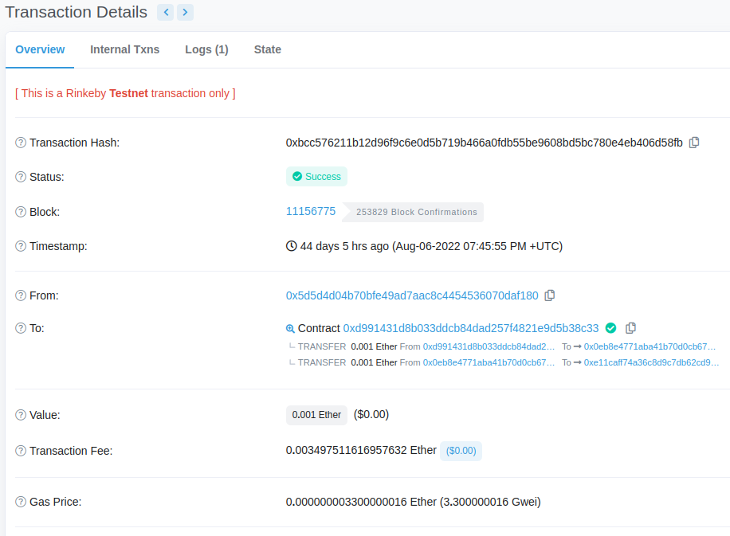
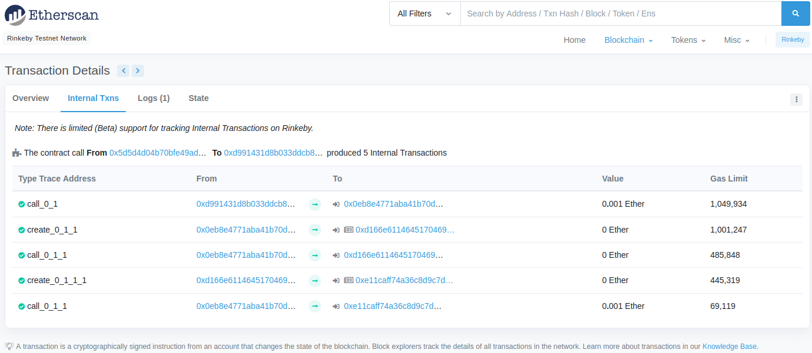

# Ethernaut Walkthrough: Recovery
## Welcome to KweenBirb's 18th installment of Ethernaut walkthroughs! 

Ethernaut is a set of gamified Solidity challenges in the style of a CTF, where each level features a hackable smart contract that will inform you of various known security vulnerabilities on EVM blockchains.

This repo will walk you through a solution to Recovery.sol, the 18th challenge in the series. You can find the challenge itself and fully fleshed out solution in the .txt file in the root directory and .sol file in this directory. Let's begin!

In this challenge, Ethernaut describes a factory contract that was used to deploy an instance of the provided SimpleToken contract onto the Ethereum network. Unfortunately for the contract creator, the SimpleToken deployment address was forgotten! Ethernaut states: 'This level will be completed if you can recover (or remove) the 0.001 ether from the lost contract address.'

Looks like we're getting a break today- this is likely the simplest level yet! Chances are anyone completing these Ethernaut challenges has already used Etherscan extensively for various reasons, and we'll leverage that comfort zone to complete this one.

All we'll have to do is identify the lost contract address and call the nifty destroy() function to selfdestruct() the token and recover that juicy 0.001 eth.

## To Etherscan we go!

We simply head on over to rinkeby.etherscan.io to inspect $your_ethernaut_instance contract address. Here, we can easily identify the transaction that created your level instance and sleuth around a bit to find any addresses (with a balance of 0.001 eth) previously created by the Recovery factory via its generateToken() function.

On perusing the transaction overview that created your level instance, you'll see that the Ethernaut factory transferred 0.001 eth to two addresses. That seems promising!



Knowing this, let's take a closer look at the internal actions of this transaction:



There we have it, two CREATE opcodes that deployed brand new contracts and then seeded them with 0.001 ether each via CALL.

So which contract is the lost one that we need to selfdestruct()? Well one address should be the factory contract, ie the ethernaut instance, which should be the one that created a SimpleToken. When we check which address matches the ethernaut instance returned by ```await instance``` we now know that to be the factory contract. You'll note in the traces above that that address is indeed the one that created the second contract.

## Shiva's target identified: ready, aim, fire!

Once we've selected the second contract as our target to destroy, we can spin up a short code snippet to blow it up:

```
function destroy() public {
    simpleToken.destroy(payable(msg.sender));
}
```

This way, Shiva will call the destroy function and we can extract the contract balance as a reward for discovering the lost contract address. Sublime.

○•○ h00t h00t ○•○