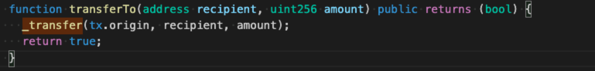

# Ethernaut Walkthrough: Telephone
## Welcome to KweenBirb's 5th installment of Ethernaut walkthroughs! 

Ethernaut is a set of gamified Solidity challenges in the style of a CTF, where each level features a hackable smart contract that will inform you of various known security vulnerabilities on EVM blockchains.

This repo will walk you through a solution to Telephone.sol, the 5th challenge in the series. You can find the challenge itself and fully fleshed out solution in the .txt file in the root directory and .sol file in this directory. Let's begin!

In this challenge, Ethernaut instructs us to 'Claim ownership of the contract below to complete this level.' Let's get pwning.

## On tx.origin

The instance contract comprises only a handful of lines of code, possessing a public address variable in storage called owner and a function called changeOwner() that performs its namesake by updating the owner address in storage.

But there's one obstacle standing in our way: 

```if (tx.origin != msg.sender)```

So what is tx.origin? Rather than push you to the Solidity lang documentation, I'll explain it simply: tx.origin is a globally available variable within a transaction that refers to the originatooor of said tx. It is clearly aptly named, then!

Its type will always be an address; more specifically an EOA due to the fact that every EVM transaction requires initiation by some EOA account. The above check therefore is basically ensuring that the originatooor of any call to the changeOwner() function is doing so through a smart contract.

## It has been exploited!

Here's a quick example: if an end user EOA calls changeOwner(), the tx.origin and msg.sender transaction variables will reflect that EOA. However, if that same end user were to route their function call through a smart contract that in turn calls changeOwner(), the msg.sender tx variable will be updated to the address of the proxy contract (meaning contract in the middle, not an actual proxy implementation!) and pass the check.

This mechanic introduces a number of rerouting vulnerabilities and can quickly become more complicated than the developer intends with regards to authorization. A notable example of this type of exploit is the ThorChain $RUNE-$ETH liquidity pool hack of 2021, which saw a hacker exploit tx.origin in this function:



More on that and other exploits here:

https://coinex.medium.com/coinex-security-team-the-security-risks-of-thorchain-rune-d9d1870c3a99

## Back to completing Telephone

To pass this level, we just need to route our call to changeOwner() through a smart contract of our own making. If you're still confused by this point, think in terms of the level's title: tx.origin represents Alice, who wants to speak with Bob. If they're in the same room, she can do so verbally; in which case Alice is both tx.origin and msg.sender. However, if Alice is in a different country, she can use a telephone to speak with Bob; in which case Alice remains tx.origin but the telephone has now become the msg.sender for her word data. Got it?

Okay, first let's give our contract a nifty interface to interact with Telephone:

```
interface Telephone {
    function changeOwner(address _owner) external;
}
```

Now we write a short function to use the Telephone interface:

```
function dial() public {
        telephone.changeOwner(msg.sender);
}
```

Voila! Configure your addresses, pick up your cellphone, and dial() Bob's Telephone to become its owner. Imagine if phones really worked that way O.o

○•○ h00t h00t ○•○
